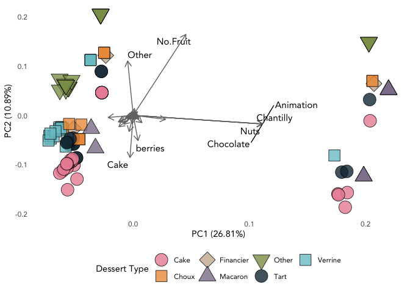
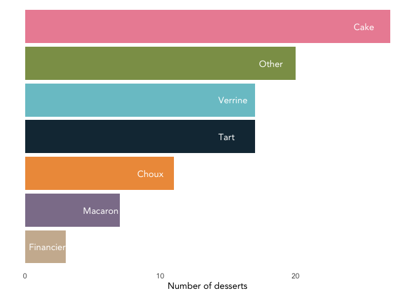
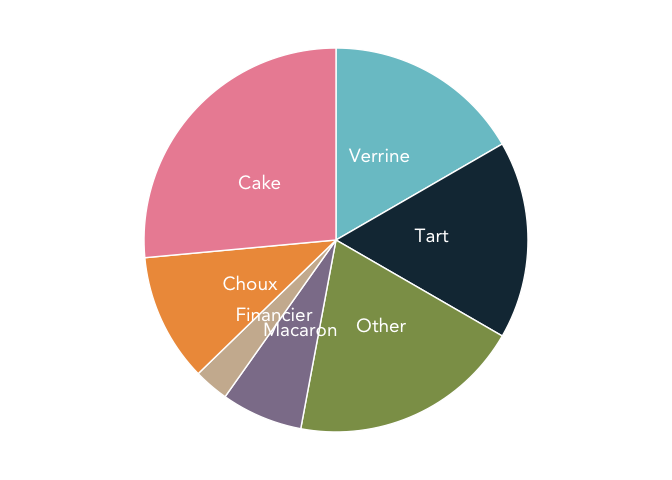
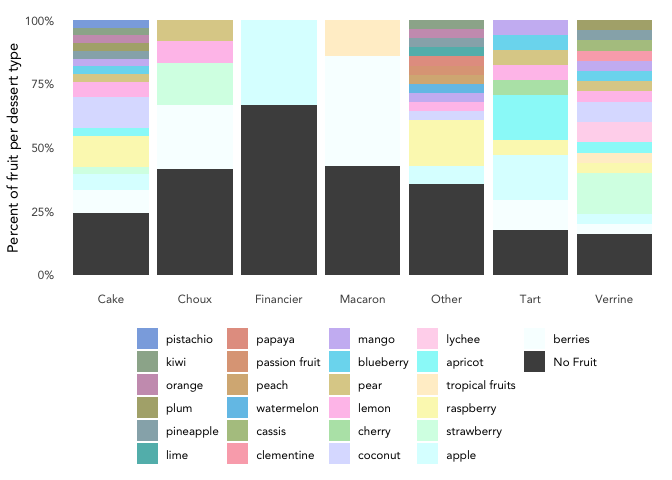
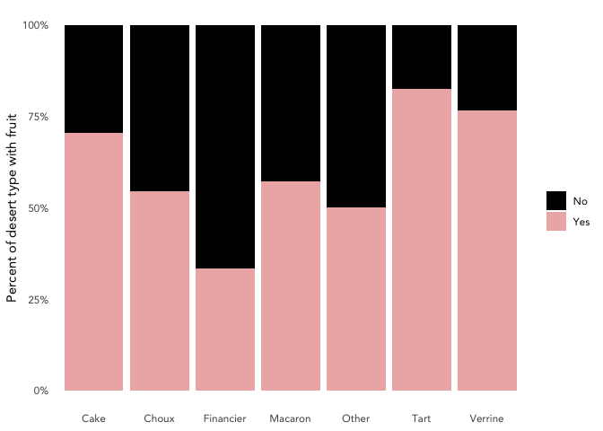
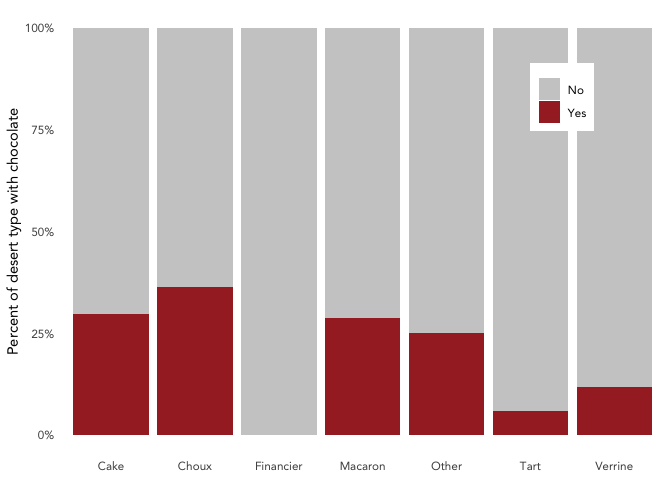
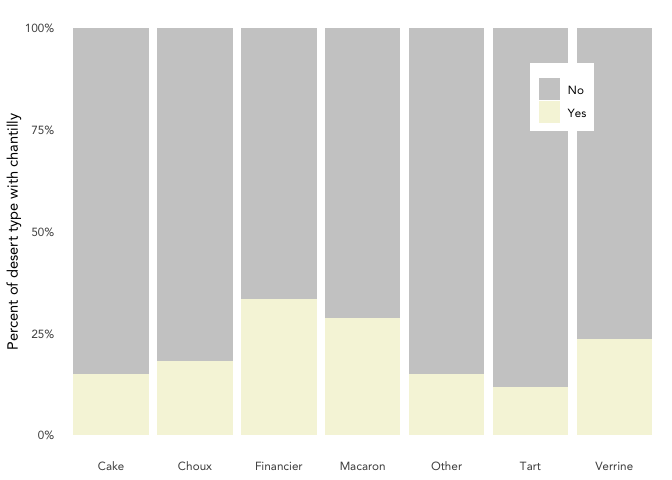
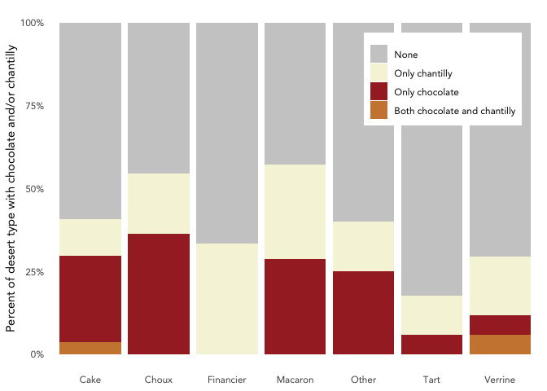

Sweeter than Science:
================
Rebecca Stevick
2/21/2022

# Setup and Oragnize

## Load libraries and settings

``` r
# load libraries
library(tidyverse)
library(nationalparkcolors)
library(ggtext)
library(readxl)

# global theme
theme_set(theme_minimal()+
             theme(text=element_text(family="Avenir"),
                   panel.grid = element_line(color="white")))

# rmd settings
knitr::opts_chunk$set( warning=FALSE, message=FALSE)
```

## Import data

``` r
dessertsdata <- read_excel("PasteurCanteenDesserts.xlsx")

# check data
dim(dessertsdata)
```

    ## [1] 102   9

``` r
str(dessertsdata)
```

    ## tibble [102 × 9] (S3: tbl_df/tbl/data.frame)
    ##  $ DessertName: chr [1:102] "Almond apple biscuit" "Apple caramel financier" "Apple half sphere" "Apple pie" ...
    ##  $ DessertType: chr [1:102] "Cake" "Financier" "Other" "Tart" ...
    ##  $ MainColor  : chr [1:102] "Brown" "Brown" "Brown" "Brown" ...
    ##  $ MainFlavors: chr [1:102] "almond, apple, caramel, cream" "apple, caramel" "apple, caramel" "apple, vanilla" ...
    ##  $ Fruit      : chr [1:102] "apple" "apple" "apple" "apple" ...
    ##  $ Chocolate  : chr [1:102] "No" "No" "No" "No" ...
    ##  $ Chantilly  : chr [1:102] "Yes" "Yes" "No" "No" ...
    ##  $ Nuts       : chr [1:102] "Yes" "No" "No" "No" ...
    ##  $ Animation  : chr [1:102] "Yes" "No" "No" "No" ...

``` r
colnames(dessertsdata)
```

    ## [1] "DessertName" "DessertType" "MainColor"   "MainFlavors" "Fruit"      
    ## [6] "Chocolate"   "Chantilly"   "Nuts"        "Animation"

## Organize data for phylogeny & PCA

``` r
# make a matrix
subset <- dessertsdata %>% select(DessertName, DessertType, Nuts, Fruit:Animation) %>% 
   separate_rows(Fruit, sep=", ")

# convert to binary
binarytable <- subset %>% 
   pivot_wider(names_from = "Fruit", 
            values_from = 'Fruit', 
            values_fill = 0,
            values_fn = function(x) 1) %>% 
   rename("No.Fruit"="none") %>% 
   pivot_wider(names_from = "DessertType", 
            values_from = 'DessertType', 
            values_fill = 0,
            values_fn = function(x) 1) %>% 
   mutate(Nuts=recode(Nuts, "Yes"=1,"No"=0),
          Chocolate=recode(Nuts, "Yes"=1,"No"=0),
          Chantilly=recode(Nuts, "Yes"=1,"No"=0),
          Animation=recode(Nuts, "Yes"=1,"No"=0)) %>% 
   rename_all(make.names)

# without fruits as individual categories
binary2 <- dessertsdata %>% select(DessertName, DessertType, Nuts, Fruit:Animation) %>% 
   mutate(Fruit = case_when(Fruit == "none" ~ 0,
                            TRUE ~1)) %>% 
   pivot_wider(names_from = "DessertType", 
            values_from = 'DessertType', 
            values_fill = 0,
            values_fn = function(x) 1) %>% 
   mutate(Nuts=recode(Nuts, "Yes"=1,"No"=0),
          Chocolate=recode(Nuts, "Yes"=1,"No"=0),
          Chantilly=recode(Nuts, "Yes"=1,"No"=0),
          Animation=recode(Nuts, "Yes"=1,"No"=0))

#dessertsdata %>% write_csv("AllDesserts.csv")
#write_csv(binarytable, "binaryDesserts.csv")
```

# PCA plot

``` r
library(vegan)
library(gridExtra)
library(ggfortify)

table <- binarytable %>% column_to_rownames("DessertName")

pca_result <- prcomp(table)

pca_result$rotation <- -pca_result$rotation # rotate PC axes
head(pca_result$rotation) # check on variable

pca_result$x <- - pca_result$x # rotate x-axis
autoplot(pca_result) # plot basic result
```

``` r
# generate basic plot
aplot<-autoplot(pca_result,
                size=7,  alpha=0.8, # size of points
                data=dessertsdata, # identify metadata to use for plotting
                fill="DessertType",shape="DessertType", # change point fill and shape by site
                loadings=TRUE, # include arrows
                loadings.label=TRUE, # include arrow labels
                loadings.label.fontface="bold",
                loadings.label.family="Avenir",
                loadings.label.repel=TRUE, # don't overlap arrow labels
                loadings.label.size=4,
                loadings.label.colour="black",
                loadings.colour=c("grey45"))
```

``` r
aplot +
  scale_fill_manual(values=c("#EC8FA3", "tan2", "bisque3", "#8D7F99", "#8C9D57", "#163343","cadetblue3"))+
  scale_shape_manual(values = c(21,22,23,24,25, 21,22))+
   labs(fill = "Dessert Type", shape="Dessert Type")+
   theme(legend.position = "bottom")
```

<!-- -->

``` r
#ggsave("DessertsPCA.svg", bg="white", width=6, height=7)
```

# Overall Plots

## Bar plot per type

``` r
# bar chart
dessertsdata %>% 
   group_by(DessertType) %>% count() %>% 
   ggplot(aes(y=reorder(DessertType,n), x=n, fill=DessertType))+
   geom_col()+
   geom_text(aes(label=DessertType, x=n-2.7), color="white", family="Avenir", hjust=0)+
   scale_fill_manual(values=c("#EC8FA3", "tan2", "bisque3", "#8D7F99", "#8C9D57", "#163343","cadetblue3"))+
   theme(legend.position = "none", axis.text.y = element_blank(),
         panel.grid.major.y = element_blank())+
   labs(x="Number of desserts", y=NULL)
```

<!-- -->

``` r
#ggsave("dessertbargraph.svg",bg="transparent", width=6, height=3.5)
```

## Pie chart per type

``` r
# pie chart
dessertsdata %>% 
   group_by(DessertType) %>% count() %>% 
   arrange(desc(DessertType)) %>% 
   ungroup() %>% 
   mutate(prop = n / sum(n) *100) %>%
   mutate(ypos = cumsum(prop)- 0.55*prop) %>% 
   ggplot(aes(x="", y=prop, fill=DessertType)) +
   geom_bar(stat="identity", width=1, color="white") +
   coord_polar("y", start=0) +
   theme_void() + 
   theme(text=element_text(), legend.position="none") +
   geom_text(aes(y = ypos, label = DessertType), color = "white", size=5, family="Avenir") +
   scale_fill_manual(values=c("#EC8FA3", "tan2", "bisque3", "#8D7F99", "#8C9D57", "#163343","cadetblue3"))
```

<!-- -->

``` r
#ggsave("dessertspiechart.svg",bg="transparent", width=6, height=5)
```

## Bar plot per fruit

``` r
dessertsdata %>% 
   separate_rows(Fruit, sep=", ") %>% 
   mutate(Fruit = case_when(Fruit == "none" ~ "No Fruit",
                            TRUE ~ Fruit)) %>% 
   group_by(Fruit, DessertType) %>% count() %>% 
   group_by(DessertType) %>% mutate(prct=n/sum(n)) %>% 
   ggplot(aes(x=DessertType, y=prct, fill=reorder(Fruit,prct)))+
   geom_col()+
   # geom_text(aes(label=Fruit))+
   scale_y_continuous(labels=scales::label_percent())+
   scale_fill_manual(values=c("#8bade1", "#9cb19a", "#cc9ebc", "#b0ae7b",
                              "#96b0b8", "#61bab9", "#e49f90", "#dea586",
                              "#d7b484", "#74c4e9", "#b2c58f", "#faaeb9",
                              "#ccbcf3", "#7adbf0", "#ddcf97", "#ffc4ec",
                              "#b6e4b5", "#dce0ff", "#ffd8ed", "#98f9f9",
                              "#ffefcf", "#fbf8bd", "#d5ffe6", "#dbffff", 
                              "#f8ffff","grey30"))+
   labs(x=NULL, y="Percent of fruit per dessert type", fill=NULL)+
   theme(legend.position = "bottom")
```

<!-- -->

``` r
#ggsave("fruitspercent.svg", bg="transparent", width=5.5, height=4.5)

dessertsdata %>% 
   mutate(FruitYesNo = case_when(Fruit == "none" ~ "No",
                                 TRUE ~ "Yes")) %>% 
   ggplot(aes(x=DessertType, fill=FruitYesNo))+
   geom_bar(position="fill")+
   scale_y_continuous(labels=scales::label_percent())+
   scale_fill_manual(values=c("black", "rosybrown2"))+
   labs(x=NULL, y="Percent of desert type with fruit", fill=NULL)
```

<!-- -->

# Chocolate and Chantilly plots

## Chocolate

``` r
dessertsdata %>% 
   ggplot(aes(x=DessertType, fill=Chocolate))+
   scale_y_continuous(labels=scales::label_percent())+
   scale_fill_manual(values=c("grey80", "brown"))+
   geom_bar(position="fill")+
   theme(legend.position=c(0.83, 0.8), legend.background = element_rect(fill="white", color="transparent"))+
   labs(x=NULL, y="Percent of desert type with chocolate", fill=NULL)
```

<!-- -->

``` r
#ggsave("chocolatechart.svg",bg="transparent", width=4.5, height=3)
```

## Chantilly

<!-- -->

## Together

``` r
dessertsdata %>% 
   unite("ChocChan", Chocolate, Chantilly) %>% 
   ggplot(aes(x=DessertType, fill=ChocChan))+
   scale_y_continuous(labels=scales::label_percent())+
   scale_fill_manual(values=c("grey80","beige", "brown", "tan3"),
                     labels=c("None","Only chantilly", "Only chocolate", "Both chocolate and chantilly"))+
   geom_bar(position="fill")+
   theme(legend.position=c(0.8, 0.8), legend.background = element_rect(fill="white", color="transparent"))+
   labs(x=NULL, y="Percent of desert type with chocolate and/or chantilly", fill=NULL)
```

<!-- -->

``` r
#ggsave("chocolatechantillychart.svg",bg="transparent", width=4.5, height=4.5)
```
